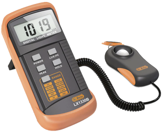

# Lab 1: electrical power

In this lab you will test FlatSAT's solar panel to determine if it will generate enough power to satisfy mission requirements. You will measure the voltage and current generated by the solar array at varying loads to generate an I-V plot. You will collect two sets of I-V measurements, one for a series-connected array and one for a parallel-connected array. 

You will also record solar illuminance with a luxmeter at the time of your power measurements. 

In your post-lab analysis, you will compare your prelab predictions to the results you record in this lab. You will present your I-V plot and use it to identify your array's peak power. You will calculate array efficiency using the incident luminosity and the peak power generated. Finally, you will recommend any design changes necessary to ensure the solar array can meet mission requirements.

## equipment

- laptop
- micro USB cable
- halogen lamp
- USB micro SD card reader
- luxmeter
  

## hardware

- FlatSAT
  - Arduino MKR Zero
  - micro SD card
  - INA219 current sensor
  - solar array

## software

- Arduino IDE
- Arduino SAMD drivers (already installed)
- Arduino libraries (`install_libraries.bat`)
  - liquidcrystal
  - adafruit ina219

- `lab_01_electrical_power.ino`

## setup

Connect components

- 16 x 2 character LCD
  - power and ground as shown
  - pin 3 to ground through a 1k$\ohm$ resistor
  - 6x data lines as listed in `LCD_pins.h`
    - appears as tab in arduino IDE
- INA219 current sensor breakout board
  - solar panel rails as shown
  - QWIIC cable as listed in `INA219_pins.h`
- Arduino MKR Zero
  - power from computer via USB
  - provides 3.3V on Vcc pin
  - provides 5V on 5V pin
  - connect ground
  - will need microSD card during lab operation

### prepare microSD card

The Arduino MKR Zero has a microSD card slot. You will use this card to store data in various labs. If this is your first lab with an SD card, prepare the card. 

- insert the card in the USB reader and connect to your computer
- Format the card
  - Window Explorer -> Right click -> format -> Fat 32 -> Ok
  - While you format the card, name it after your group
- Insert the card into your Arduino MKR Zero

### solar array

Record which solar panel you are using. 

Connect the four cells of the array in parallel. You will complete the data collection steps, and then repeat them with the cells connected in series.

Connect the solar array's output to the breadboard's bottom power rail. The array’s positive output must connect to the red rail. 

## upload FlatSAT code and test setup

Open `lab_01_electrical_power.ino` in the Arduino IDE. 

Connect Arduino to computer via USB. 

Select the correct board (Arduino MKRZERO) and port. 

Upload your code. 

Open serial monitor (tools -> serial monitor).

Expose the solar panel to the halogen light. 

Slowly turn the potentiometer and watch the current and voltage change on the LCD. 

Disconnect the Arduino and turn off the halogen light. 

## data collection scheme

FlatSAT saves current and voltage to `iv_curve.csv` every 500 ms. On each powerup it writes a legend and then begins logging data. Subsequent powerups will again write a legend and add more data to the file. The legend message can be used to separate test runs. It will be obvious which run is series vs parallel. 

## collect solar array performance data outside

Disconnect power so you're not saving excess data. 

Take FlatSAT and the luxmeter outside and find a test site in direct sunlight. 

Point the luxmeter toward the sun and record the sun's power in lux. You will have to adjust the range to its maximum setting. The measured value may jump around, try to take an average value. Record the average for later use calculating efficiency. 

Point FlatSAT at the sun and power it on. *Very* slowly (slower than you’re thinking), turn the potentiometer from one end to the other. FlatSAT will record current and voltage at 500 ms intervals. Record periodic current and voltage measurements from the LCD display as a backup in case the stored data gets corrupted or lost. 

Remove the potentiometer to record a measurement of $V_{oc}$. Short the potentiometer pins with a wire to record a measurement of $I_{sc}$. 

Disconnect power, rewire the solar array in series, and repeat these steps to collect the series I-V data. 

## data collection and analysis

- record your solar panel number
- record your illuminance measurement
- transfer `iv_curve.csv` to your computer for later analysis

## cleanup

Leave all FlatSAT components and wires connected for future labs. 

Turn off everything and straighten your work area. 
