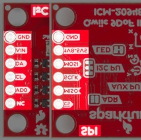
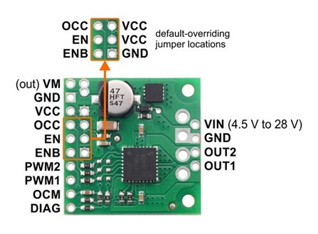
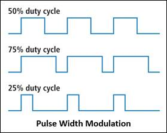
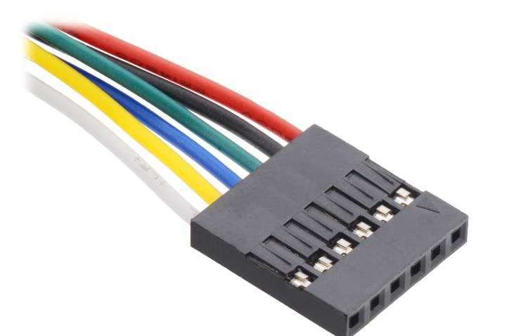

# Lab 4: attitude

In this lab you will build and test part of FlatSAT's attitude system including an attitude sensor and reaction wheel. (FlatSAT's design calls for 3 reaction wheels but you will only test 1.) You will measure system performance to ensure that FlatSAT can meet it's orbital torque and momentum requirements. 

Prelab instructions: 
https://www.overleaf.com/read/prdzpknpdtgf

## equipment

- 1 laptop
- micro USB cable 
- string
- tachometer
- benchtop power supply

## hardware

- FlatSAT
  - components from previous labs
  - TB9051FTG motor controller (green PCB)
  - SparkFun 9 DOF IMU
  - reaction wheel assembly
  - 3 cell Li-ion battery
  - BEC
  - wago wire connectors

## documentation

- motor datasheet (Pololu 37D metal gearmotor)
- motor driver datasheet (Pololu TB905FTG motor driver carrier)
- IMU datasheet (SparkFun 9DoF IMU)

## software

- Arduino IDE

- Arduino SAMD drivers (already installed)
- Arduino libraries (install via GUI or by running `install_libraries.bat`)

  - SparkFun 9DoF IMU
  - TB9051FTGMotorCarrier
  - QuadratureEncoder
  - EnableInterrupt

- `lab_04_attitude.ino`

## setup

For today’s lab, FlatSAT will be powered by a lithium ion battery. 

- connect power and ground 

  - **Note: ensure that 12V is only applied to the BEC and one pin of the motor driver board**
  - Using a wago, connect 3 12V lines
    - battery
    - BEC
    - motor carrier

  - repeat with 3 ground lines
    - battery
    - BEC
    - breadboard ground rail

- prepare to connect BEC 5V output to FlatSAT

  - connect ground
  - **Note: do not connect power at this time**

  

- place IMU (red square) and motor driver (green square) on FlatSAT
- place an LED on pin A0 and connect it to ground via a resistor—the short leg must connect to ground. 

  - same wiring as in communication lab

### IMU

The inertial measurement unit (IMU) communicates with Arduino via I2C. 

- power
- ground
- SDA
- SCL

### motor driver

FlatSAT controls a brushed DC motor via a Toshiba TB9051FTG brushed motor driver. FlatSAT sends a low-volt/low-current pulse-width modulated (PWM) signal to the motor driver board. The driver board provides line voltage to the motor at the same duty cycle. A high signal is full voltage and a low signal is zero voltage, and we use the duty cycle to essentially act as a fraction between those two. So, a 50% duty cycle corresponds to applying 50% of the total voltage that would correspond to the motor’s top speed. Thus, the higher the PWM command, the faster the motor will spin.

- (driver pin–Arduino pin)

- GND to ground

- ENB to ground

- VCC to 5V

- EN to 5V

- PWM2–D3 (~3)

- PWM1–D2 (~2)

- OCM–A1

  

- leave 2 wires sticking out of Vin and GND (the motor side)

  - These will later connect to a 12V supply for motor power

### motor

FlatSAT's reaction wheel motor is a metal gearmotor (Pololu item 4758). 

- gear ratio: 10:1
- voltage: 12 V

The motor has a 6-wire connector with 2 wires each for motor power, speed encoder power, and encoder output. Connect it to FlatSAT. 

| FlatSAT pin       | motor harness color | function         |
| ----------------- | ------------------- | ---------------- |
| motor driver OUT1 | red                 | motor power      |
| motor driver OUT2 | black               | motor power      |
| ground            | green               | encoder ground   |
| 3.3V              | blue                | encoder power    |
| Arduino A2        | yellow              | encoder output A |
| Arduino D6        | white               | encoder output B |

## rotor mass properties

Measure the diameter and mass of the reaction wheel. There is a spare rotor and a scale on the filing cabinets near the door. Use these values to calculate momentum storage and compare your predictions to measurements. 

## attitude determination

Now you will test FlatSAT's attitude sensor as the reaction wheel changes spacecraft attitude.   

Install an SD card into FlatSAT. Open and upload `lab_04_attitude.ino`. Open the serial plotter and place FlatSAT in different orientations. Wave a magnet around the sensor. Disconnect the USB cable from FlatSAT. 

`lab_04_attitude.ino` will command the wheel to different speeds and record magnetometer and gyroscope data. 

Tape FlatSAT to one end of the reaction wheel assembly Tape the battery to the other end.  Using string, hang the assembly from the hook at your workstation. Make it level. 

When you are ready, connect the BEC's 5 V output to Arduino's Vin. This is what will happen. 

- The rotor will spin up and maintain a steady-state speed of approximately 500 RPM for approximately 10 seconds. Hold FlatSAT steady during this time. 
- The LED will illuminate when FlatSAT is holding still. If it’s drifting you can help it gently. 
- The LED will deluminate when FlatSAT is accelerating. Don’t touch it. 
- FlatSAT's wheel speed will ramp up and back down over the course of 5 seconds, ending up at 500 RPM. FlatSAT should hold steady at this orientation for 5 seconds. 
- FlatSAT's wheel speed will ramp down and back up over the course of 5 seconds, again ending up at 500 RPM. FlatSAT should hold steady at this orientation for 5 seconds. 
- FlatSAT will command the wheel to zero speed. Allow FlatSAT to spin freely. 
- After 5 seconds of spinning, stop FlatSAT and remove power. 

FlatSAT will record information from its rate gyros and magnetometer to `attitude.csv` on the SD card. Remove the SD card and save the data for your team's later use. 

## Lab station cleanup

- Transfer saved data to your group's storage location
- Disconnect devices from FlatSAT and all computers
- Remove the ESD wrist straps and replace them in the bag at your lab station.
- Replace all items at your lab station the way you found them. 
- Close Arduino IDE, and log out of the laptop.
- Have your instructor check off your lab station before you depart.

## Post-lab data analysis

Use your measured mass properties and the provided max speed/acceleration data to determine reaction wheel torque. 

Use your recorded attitude data to determine the MOI of the entire FlatSAT assembly. Do this with the wheel speed data and IMU data immediately before and after the wheel turned off. 

Include graphs of IMU data (magnetometer AND rate gyro) in your final report. 

