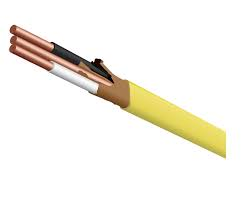

# 05: electricity

## admin

### assignments

distribute graded work

## electricity

What functions do we use electricity for?

- power transfer
- power storage?
- signals
- processing

What are other ways to transfer power?

Why do we choose electricity?

- fungible
- easy to control/transport

This lesson is pretty basic, mostly EE 315/210, but

- some of you haven’t taken it
- it should cover some additional practical aspects

Sparkfun tutorials cover it pretty well—we’ll scroll through some. 

https://learn.sparkfun.com/tutorials/what-is-electricity/all

https://learn.sparkfun.com/tutorials/voltage-current-resistance-and-ohms-law

https://learn.sparkfun.com/tutorials/electric-power

https://learn.sparkfun.com/tutorials/how-to-use-a-multimeter

### Sparkfun Takeaways

$$
V=IR
$$

$$
P=IV=\frac{V^2}{R}=I^2R
$$

- avoid short circuits
- conductors and components have a current limit
- circuits need a return path
  - on = closed (short-circuit is super-closed—usually bad)
  - off = broken = open

### multimeter use

- voltmeter always safe up to rated voltage (600V?)
  - voltmeter approximates an infinite resistor (insulator)
- never connect an ammeter to a voltage source
  - ammeter approximates zero resistance (conductor)
  - something will break/trip/catch on fire:
    - ammeter fuse
    - ammeter wires
    - circuit breaker
    - building wires
    - service breaker
    - substation breaker
    - distribution lines
    - power plant
- never connect an ohmmeter to an energized circuit
  - ohmmeter measures drop of a small applied voltage—erroneous if external voltage exists

### mains electricity/utility power

US power supply—building distribution

- 60 Hz
- 240 V RMS (sine wave)
- normal new homes (1980s+) have 200 A service

household outlets—NEMA 5-15

- 120 V RMS
- 15 A breaker common
- 20 A breaker slightly less common

terminology confusion

| NEC                        | real electricians | electronics tech |
| -------------------------- | ----------------- | ---------------- |
| ungrounded conductor       | hot               | power            |
| grounded conductor         | neutral           | ground           |
| equipment ground conductor | ground            | —                |

     

US single phase color conventions

| function      | mains            | electronics                                     |
| ------------- | ---------------- | ----------------------------------------------- |
| hot           | black and/or red | NOT green NOT bare probably not white |
| return path   | white            | NOT red                                         |
| safety ground | bare or green    | —                                               |

ampacity

| AWG gauge | Conductor  Diameter mm | Ohms per km | Max amps for  chassis wiring | Max amps for  power |
| --------- | ---------------------- | ----------- | ---------------------------- | ------------------- |
| 12        | 2.05232                | 5.20864     | 41                           | 9.3                 |
| 14        | 1.62814                | 8.282       | 32                           | 5.9                 |
| 16        | 1.29032                | 13.17248    | 22                           | 3.7                 |
| 18        | 1.02362                | 20.9428     | 16                           | 2.3                 |
| 22        | 0.64516                | 52.9392     | 7                            | 0.92                |
| 24        | 0.51054                | 84.1976     | 3.5                          | 0.577               |
| 28        | 0.32004                | 212.872     | 1.4                          | 0.226               |

### spacecraft standards

[NASA Standard 8739.4: Workmanship Standard for Crimping, Interconnecting Cables, Harnesses, and Wiring](https://standards.nasa.gov/standard/NASA/NASA-STD-87394)

https://youtu.be/9V0VmUcUZiA?si=-Gah3OFIlBOmiYpG

## lab

- solder practice kit
  - pronunciation: Sauter (don’t pronounce the “l”)

- measure output range of solar array

follow the lab instructions in `../minilabs/05 electricity.md`

## homework

- Think: did you do anything wrong/unsafe in today’s lab?

