# 09: onboard computing

## quiz

List one block code error detection and correction method that can correct up to one error and detect up to two errors. 

## admin

today

- lab report due
- onboard computing
- GR review

Wed

- communication

Fri

- communication lab
- prelab report due
  - https://www.overleaf.com/read/qksywqwkjcqb

## onboard computing

- computing
- faults
- reliability

This lesson covers the TT&C system and the C&DH system. 

- telemetry, tracking, and commanding
- command and data handling

#### TT&C

> **telemetry**
>
> the in situ collection of measurements or other data at remote points and their automatic transmission to receiving equipment for monitoring.
>
> The word is derived from the [Greek](https://en.wikipedia.org/wiki/Greek_language) roots *tele*, 'remote', and *metron*, 'measure'. 
>
> Systems that need external instructions and data to operate require the counterpart of telemetry: telecommand.
>
> —[wikipedia](https://en.wikipedia.org/wiki/Telemetry)

tracking: where is the spacecraft? 

(tele)command: send commands to the spacecraft

#### C&DH

(tele)command

data handling

What are we talking about?

- onboard computer (OBC)

- radio
- corresponding ground station equipment
- ancillary concepts
  - wiring harnesses
  - protocols
  - modulation 
  - data frames

We’ll talk about radios next time. 

Once upon a time, needed separate boxes for every function. 

Spacecraft-to-ground

- ADC
- multiplexing
- modulation
- amplification

Ground-to-spacecraft

- demodulation
- demultiplexing
- DAC

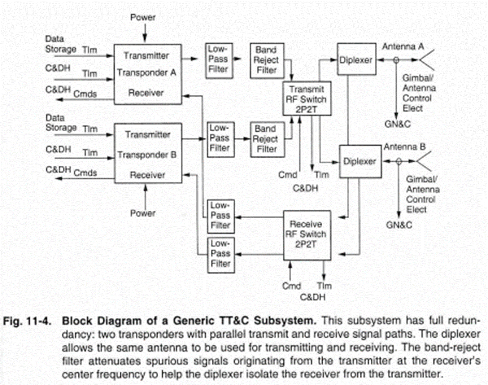

Now (at the Astro 331 level) it’s just 

- computer
- radio

Also slightly true beyond the 331 level—space computers and space radios are now COTS items (not quite commodities), even if they’re expensive

today

- on board computing
- faults
- reliability

### on board computers

Why do astronauts and submariners use Apple computers?

What is an on board computer (flight computer)?

##### Examples

FlatSAT:

- Arduino MKRZero
  - microcontroller
    - also contains ADCs, serial port, timers, etc. 

Apollo: 

- launched in 1969 (Apollo 11)
- bespoke 15(/16)-bit computer 

ISS:

- launched in 1998

- intel i386 
  - state of the art in 1985
  - microprocessor (general purpose computer)
    - needs additional components (motherboard) to communicate with the world

Perseverance:

- landed 2021
- BAE RAD750 
  - state of the art in 1998
  - single board computer
    - like a raspberry pi

What could go wrong?

> Bones: One tiny crack in the hull and our blood boils in 13 seconds. A solar  flare might crop up, cook us in our seats. And wait till you're sitting  pretty with a case of Andorian shingles. See if you're still so relaxed  when your eyeballs are bleeding. Space is disease and danger wrapped in darkness and silence.
>
> Kirk: Well, I hate to break this to you, but Starfleet operates in space. 
>
> —*Star Trek* (2009)

- software bugs
- electrical design flaws
- radiation effects
- pre-launch corrosion
- thermal-electrical stress
- thermal-mechanical stress
- mechanical stress during launch
- manufacturing and assembly errors

https://www.youtube.com/watch?v=bbaP7zhRN-4&list=PLeEC3p3fJt1dyqo8BmuujXqtWfQXi3bll&index=5

#### radiation effects

##### single event effects

- single event transient (SET) spurious signal
- single event upset (SEU) state change (memory, storage, etc.)
- single event latchup (SEL) switch closes and stays closed until a power cycle
  - bad if it shorts power to ground

##### total ionizing dose effects

- cumulative radiation exposure
  - COTS tolerance: 1–10 krad
  - rad hard tolerance: 0.1–1 Mrad

https://arstechnica.com/science/2019/11/space-grade-cpus-how-do-you-send-more-computing-power-into-space/

### faults

- **Fault**: an unexpected response whereby the function is recoverable, either by fixing it, managing around it, or by redundancy

- **Fault tolerance**: the number of faults that the system must tolerate to meet its specifications

- **Fault mitigation**: the passive mitigation of faults through design
  - Examples: ARM/EXECUTE command pairs for hazardous commands, extra solar array strings

- **Fault protection**: the implementation of design intended to actively control the effects of a fault

  - Limited to detecting and responding to discrete defects which may arise in the operation of an otherwise healthy space vehicle

  - Intended to detect faults (or the effect of a fault) and intervene so that the fault does not permanently affect the safety of the space vehicle

- **Fault management**: an engineering discipline that addresses the occurrence of faults on the space vehicle and provides a means for reducing their effect through cooperative design of both the space vehicle and ground elements and operator actions; includes fault tolerance, fault mitigation and fault protection

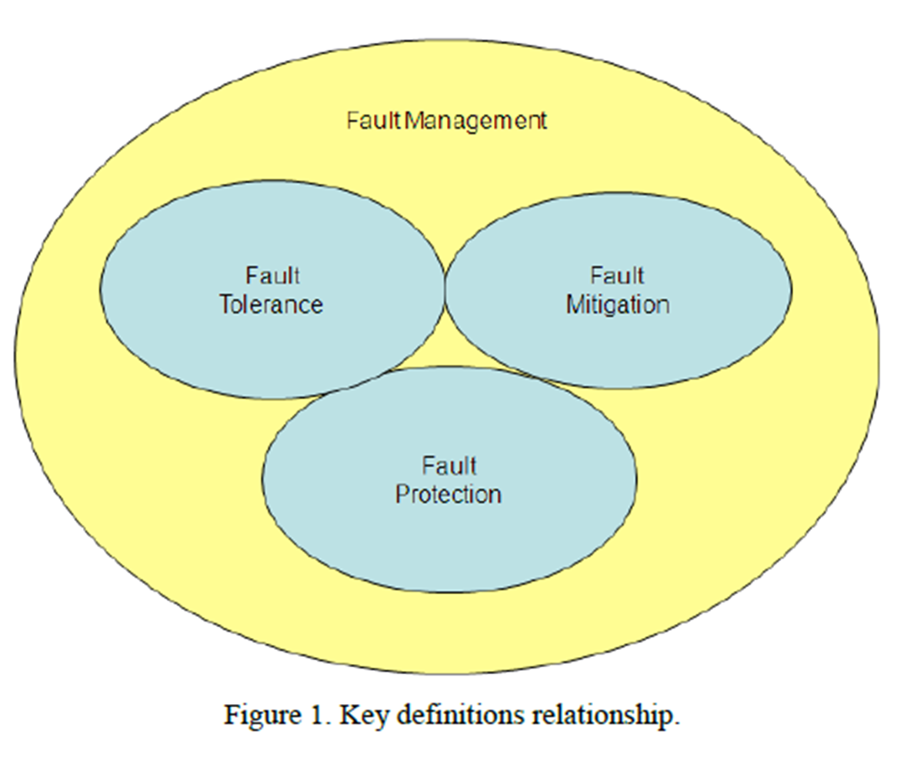

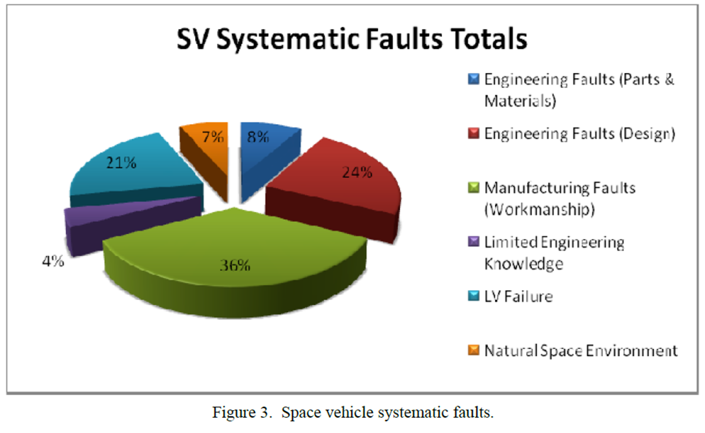

### non-computer failures

Any part can fail. How do we prevent failures?

**part screening**

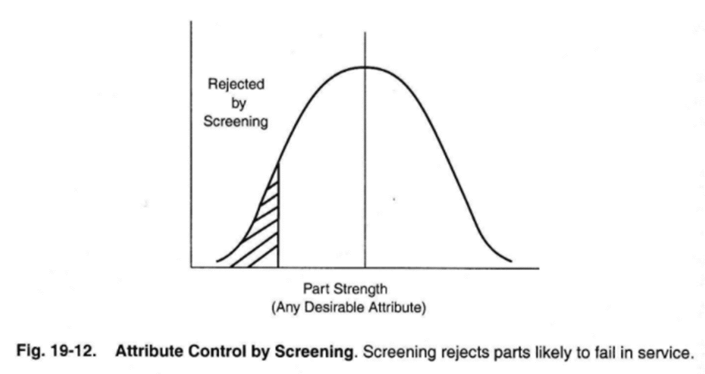

**process control**

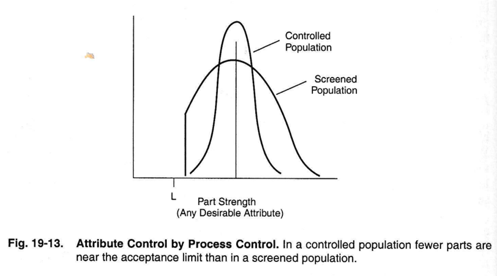

#### reliability over time

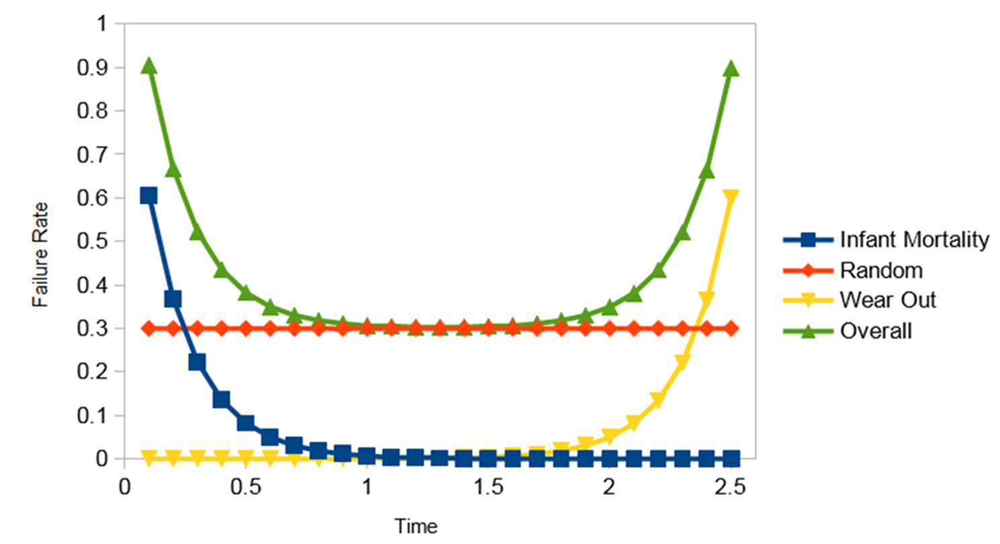

[1]: # (https://ourworldindata.org/child-mortality)

### how to deal with failures and faults

- testing to prevent
- redundancy 
- graceful degradation

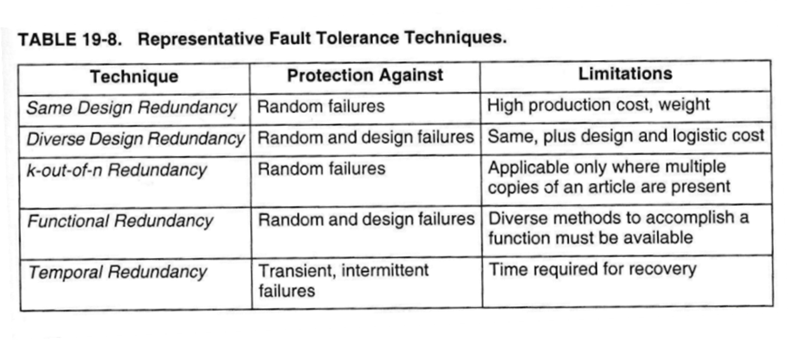

#### reliability 

this section is only applicable to random failure

$$
R = e^{-\lambda t}
$$

$$
F = 1-R
$$

$$
\lambda = 1/MTBF
$$

- R: predicted reliability
- F: failure
- $\lambda$: failure rate/time (failures/hr)
- t: time (hr)
- MTBF: mean time between failure

**series reliability**

$$
R = R_{C1} R_{C2} \ldots R_{Cn}
$$
**parallel reliability**

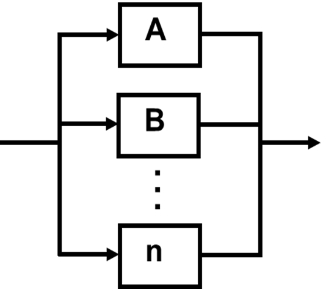
$$
R = 1- [ (1-R_{A}) (1-R_{B}) \ldots (1-R_n) ]
$$

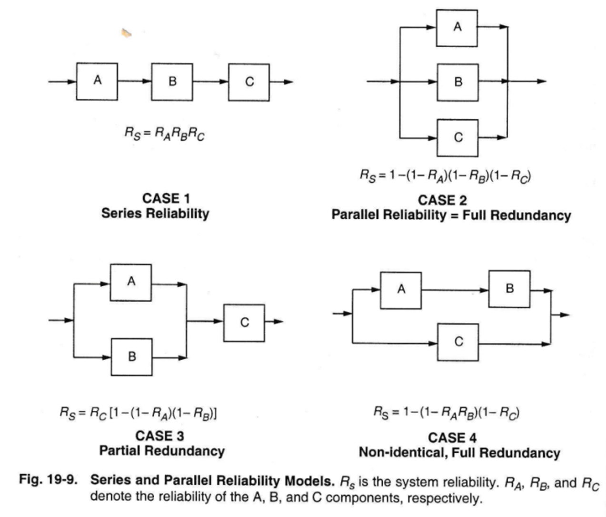

Common spacecraft redundancy method (cross-strapping)

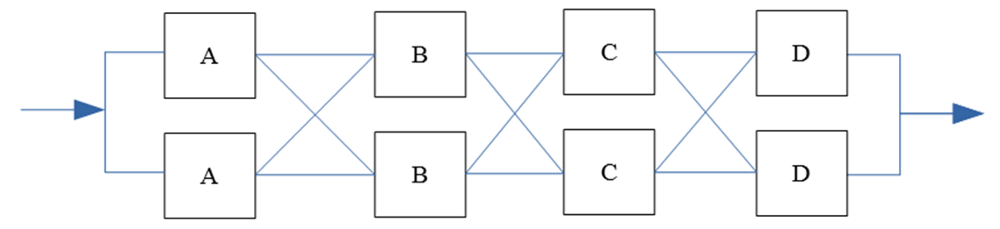

Reliability block diagram reduces to this: 

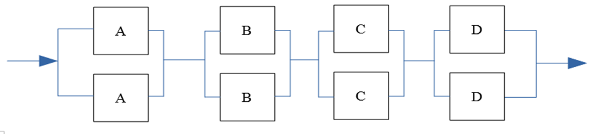

**Example**

Find system reliability

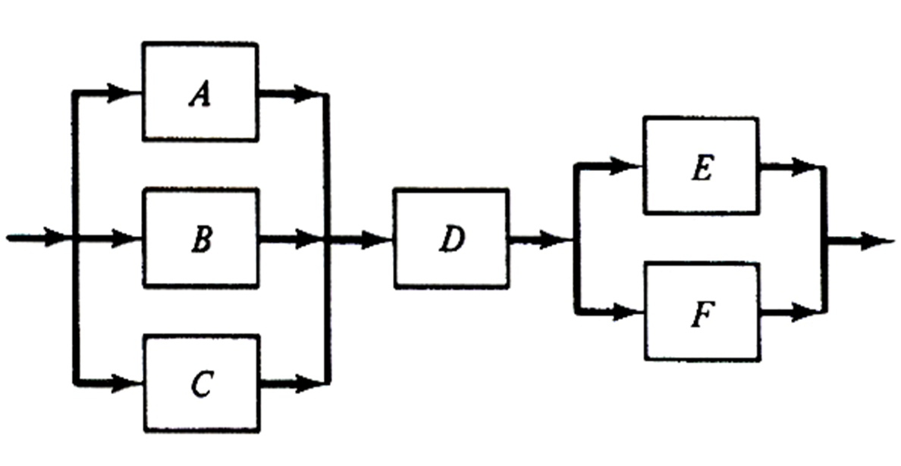

Solution: 
$$
R = [ 1-(1-R_A)(1-R_B)(1-R_C) ] R_D \ldots \\ [1-(1-R_E)(1-R_F)]
$$

## homework

- by Wednesday
  - A satellite is in a circular orbit with an altitude of 900 km. Given the satellite and ground station characteristics below, calculate the receiver gain required to guarantee a good connection (S/N ≥ 1) during the entire pass.
    - Ground Station 
    - Transmitter Gain = 10
    - Receiver Gain = ??
    - Transmitter Power = 20 W
    - Receiver Temp = 20°C
    - Transmission Frequency = 8.2 GHz
    - Bandwidth = 1.0 MHz
    - Transmission Wavelength = 0.0366 m
    - Modulation = QPSK
- by Friday
  - communication prelab report