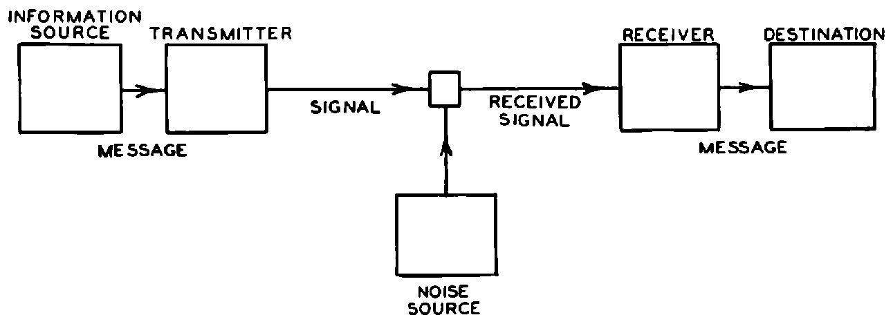
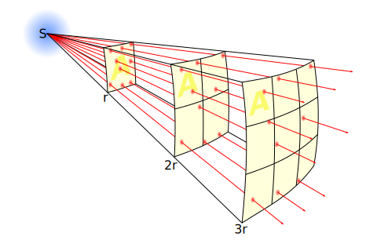
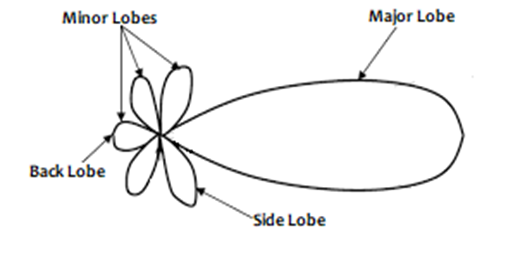
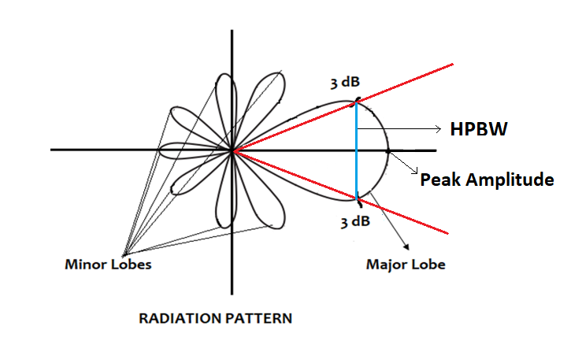
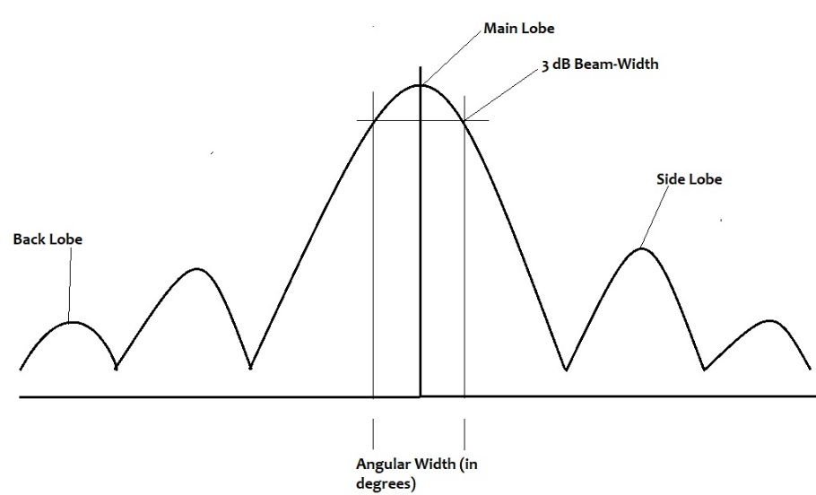
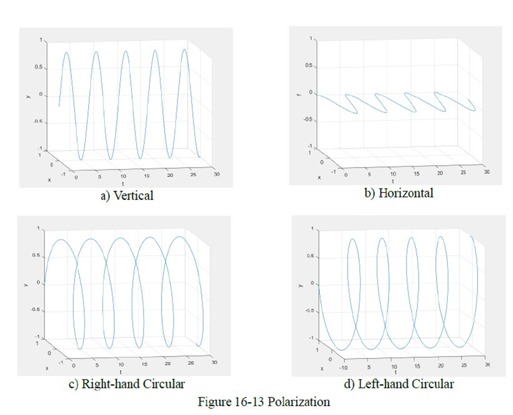
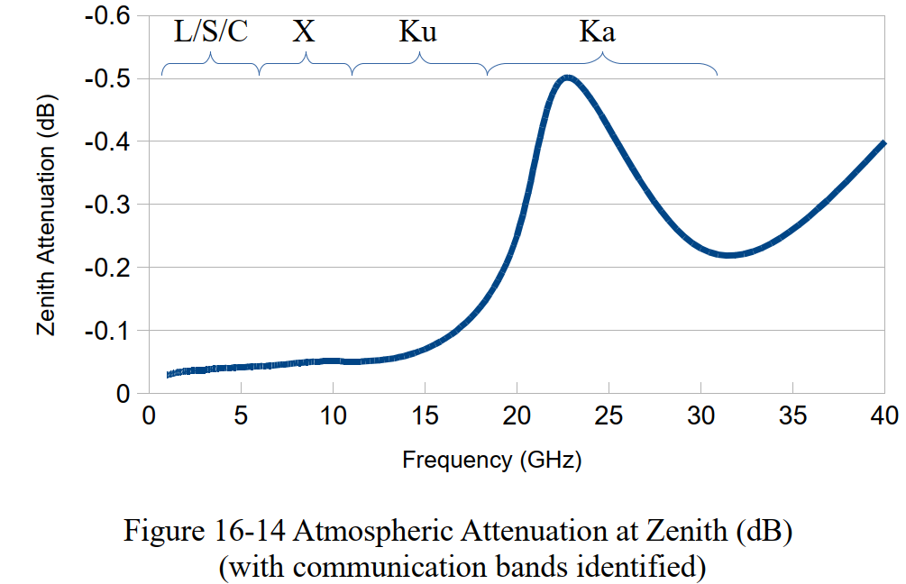
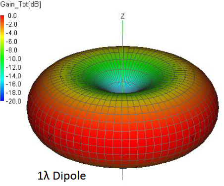

# 14: communication

## admin

today

- HW due
- GR review
- communication

Fri

- communication lab
- prelab report due
  - https://www.overleaf.com/read/qksywqwkjcqb

## communication

For today, we’ll primarily discuss satellite communication as communication with a satellite. 

Other forms of satcom include 

- satellite broadcasting 
- ground-to-ground communication via satellite relay

### satcom architectures

satellite relay 

- store and forward
- geostationary
- molniya
- bent pipe
- cross-linked spacecraft

communication with a satellite

- direct comm with ground station ()
- remote ground station 
  - own network (e.g. NASA’s Deep Space Network)
  - leased (e.g. AWS)
- spacecraft relay 

### communication performance

Is the signal sufficient for understanding?

Claude Shannon’s “Mathematical Theory of Communication” in *Bell System Technical Journal*

#### Astro 310

$$
\frac{S}{N} = \left( \frac{P_{xmtr}G_{xmtr}}{k B} \right) \left( \frac{\lambda}{4 \pi R} \right)^2 \left( \frac{G_{rcvr}}{T_{rcvr}} \right) > 1
$$

$$
c = \lambda f = 3\times 10^8 \ \mathrm{m/s}
$$

$$
k = 1.381 \times 10^{-23} \ \mathrm{J/K}
$$

$$
R_{max} = \sqrt{(R_\oplus +h)^2-R_\oplus{}^2}
$$

#### Astro 331

$$
\frac{E_b}{N_0} = \left( P_{xmtr}G_{xmtr}L_{xmtr} \right) 
( L_s L_m )
\left( \frac{G_{rcvr}L_{rcvr}}{k R T_{rcvr}} \right)
$$

$$
L_s = \left( \frac{\lambda}{4 \pi D} \right)^2
$$

$$
D = \sqrt{(R_\oplus \sin \varepsilon)^2 + h^2 + 2R_\oplus h} - R_\oplus \sin \varepsilon
$$

$$
\frac{E_b}{N_0} = \frac{S}{N} \frac{B}{R}
$$

- B: bandwidth
- $L_m$ miscellaneous losses (<1)
- $L_s$ free space path loss (<1)

differences?

analog: $\frac{S}{N}>1$ 

digital: (normalized energy per bit) $\frac{E_b}{N_0} > \ldots$ 8? 9? 10? 

scale problems

- k
- $\lambda$
- D
- R

To simplify calculations, comm engineers work in decibels (1 dB = bel/10). 

$$
X\ (dB) = 10 \log_{10} x\ (linear)
$$

$$
10^{X/10} = x\ (linear)
$$

logarithms: 

- turn multiplication into addition 
- turn division into subtraction
- map enormous ranges onto a smaller space

A decibel is a ratio. In linear terms, multiplying by 1 causes no change. The decibel equivalent is adding 0. 

Adding 3 dB is a doubling of signal strength. 

Many things in a communication chain will amplify or attenuate a signal. 

- amplifier
- transmission line losses

You will have one real unit in your comm dB equation

- dBm: decibels relative to 1 mW
- dBW: decibels relative to 1 W

**Note:** other disciplines, including controls, use $X\ (dB) = 20 \log_{10} x\ (linear)$

in dB

$$
\frac{E_b}{N_0} = \left( P_{xmtr}+G_{xmtr}+L_{xmtr} \right) + ( L_s + L_m )+ \left( G_{rcvr}+L_{rcvr}  +228.6 -10 \log_{10}R - 10 log_{10}T_{rcvr} \right)
$$

#### terms and concepts

**$L_s$ free space path loss**

$$
L_s = \left(\frac{\lambda}{4 \pi D} \right) ^2
$$

**$L_m$ miscellaneous losses**
$$
L_m = L_{point,\ xmtr} + L_{point,\ rcvr} + L_{polar} + L_{atmos} + L_{rain}
$$

**$L_{point} $ pointing losses**

$$
L_{point} = -12 \left( \frac{\theta}{\theta_{3dB}} \right)^2 \  (dB)
$$

- $\theta$ pointing error
- $\theta_{3dB}$ half-power beamwidth

**$\theta_{3dB}$ half-power beamwidth** 

depends on antenna type

Parabolic: 

$$
\theta_{3dB} = 70 \frac{\lambda}{D_p}
$$

- $D_p$: diameter of parabolic reflector

**$L_{polar}$ polarization losses**

$$
L_{polar} = 10 \log_{10} \cos^2 \theta \ (dB)
$$

**$L_{atmos}$ atmospherics losses**

$$
L_{atmos} = \frac{A_{zenith}}{\sin\varepsilon}
$$

**$L_{rain}$ rain losses**

| frequency          | attenuation |
| ------------------ | ----------- |
| <6 GHz             | 0           |
| 6 GHz < f < 18 GHz | -7 dB       |
| >18 GHz            | $\infty$    |

**$G$ gain **

amplification (positive)

directionality compared to an isotropic antenna

dipole antenna gain: 2.15 dBi

Parabolic gain

$$
G= \left( \frac{\pi D_r}{\lambda} \right)^2 \eta
$$

- $\eta$: antenna efficiency 
  - typically 0.55–0.7 for parabolic dishes

### additional info

- jamming
- EIRP
- smallsat example

## homework

- by Friday
  - communication prelab report
