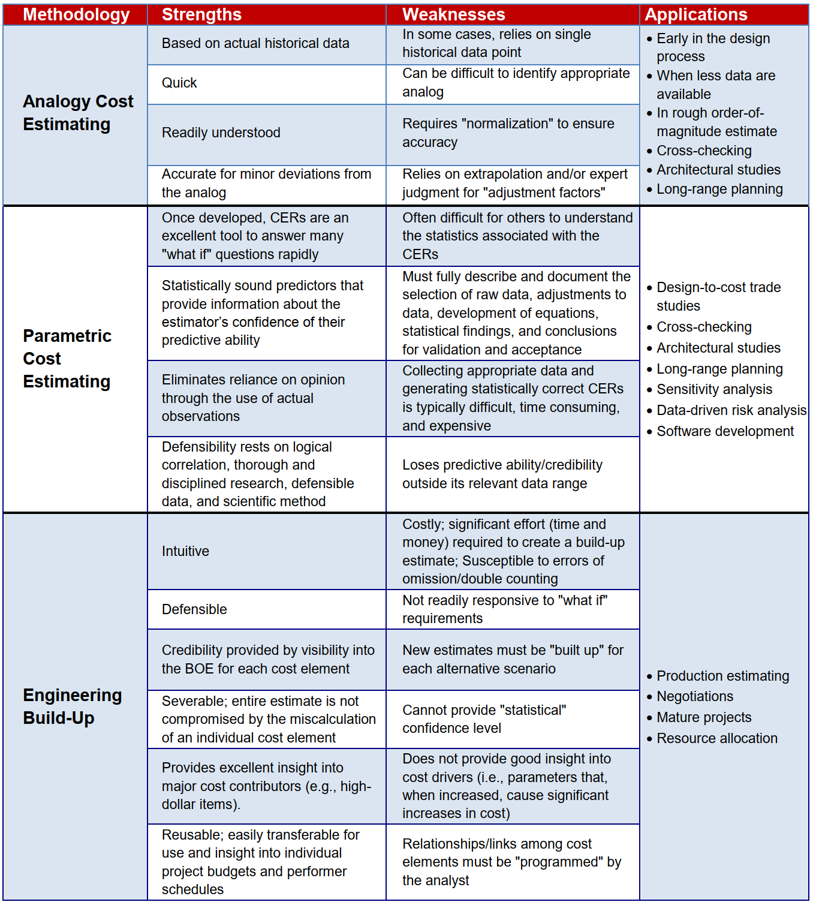
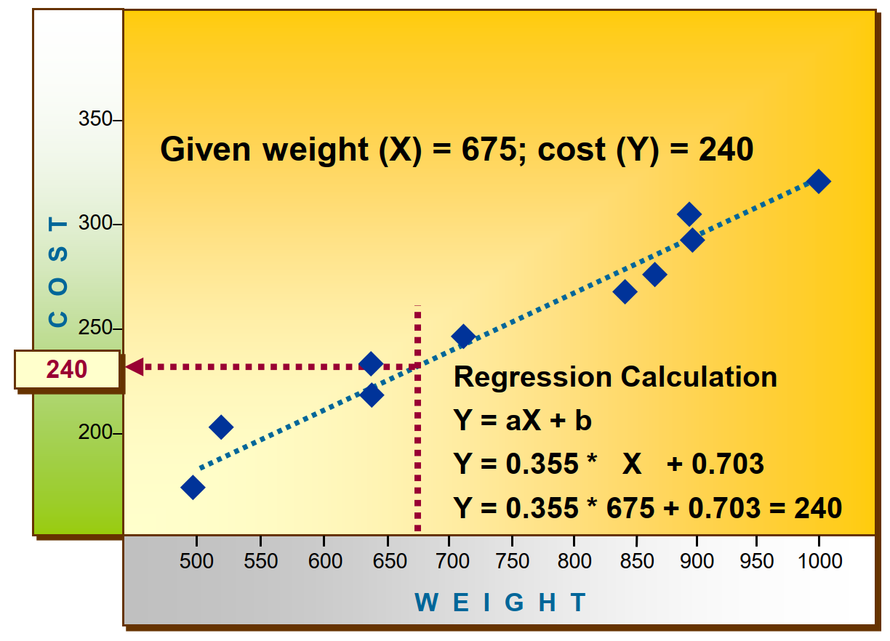
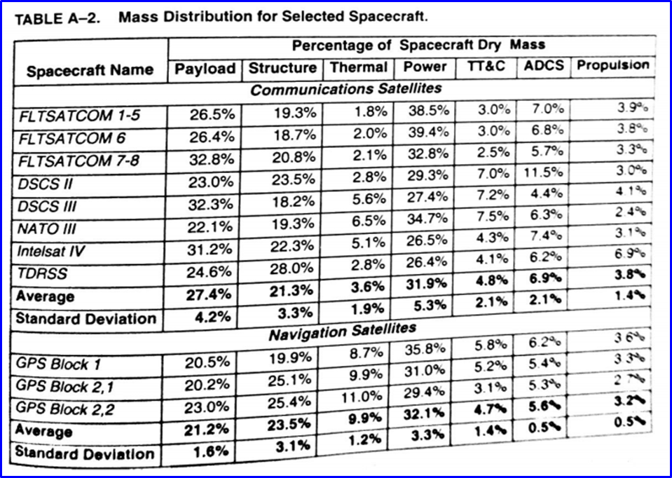
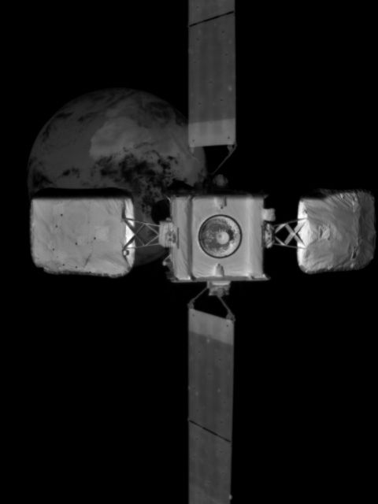
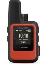

# 16: payloads and budgets

## admin

today

- budgets
- payloads

Fri

- attitude lesson
- HW due (see end of this file)

## budgets

allocation of finite resources

- power
- mass
- propellant
- reliability
- pointing
- money 
- time

Today we’ll focus on mass—principles apply to other budgets. 

terms

- **[margin](https://www.merriam-webster.com/dictionary/margin)**: a spare amount or measure or degree allowed or given for contingencies or special situations
- **dry**: mass of the unfueled spacecraft

methods 

- analogy
- parametric
- engineering
- extrapolation from actuals

parametric:

We will briefly cover mass estimation using analogy method. This was covered in the course text. For today’s in-class example we will use data from SMAD 3. 

​	

Method

payload mass $\rightarrow$ spacecraft dry mass (incl margin)$\rightarrow$ subsystem mass

given: 

- comm spacecraft
  - payload mass: 250 kg 
  - payload power: 350 W
- margin: 25%

find: 

- s/c dry mass with margin

Now do the same for power

Assume analogous estimation is appropriate. What are some other problems with these SMAD tables?

 ## payloads

We’ve talked about optical remote sensing. 

How do we assess utility of an image? 

- resolution
- swath width

What about cloud cover? motion blur? focus? illumination?

NIIRS

https://irp.fas.org/imint/niirs_c/guide.htm#t1

> The National Imagery Interpretability Rating Scale (NIIRS) is a  task-based scale used for rating imagery acquired from various imaging  systems. The NIIRS originated in the Intelligence Community and is the  standard used by imagery analysts, collection managers, imagery  scientists, and sensor designers. The imagery analysis tasks that  comprise the NIIRS have, in the past, focused mainly on military  equipment. This document provides a scale that is relevant to  environmental and civil users and serves as a "stand-alone" reference.
>
> The concept underlying the NIIRS is that imagery  analysts should be able to perform more demanding interpretation tasks  as the quality or interpretability ofthe imagery increases. The NIIRS  consists of 10 graduated levels (O to 9), with several interpretation  tasks or *criteria* forming each level. These criteria indicate the amount of information that can be extracted from an image at a given  interpretability level. With a NIIRS 2 image, for example, analysts  should lust be able to *detect large buildings*, while on NIIRS 6 imagery they should just be able to *identify automobiles as sedans or  station wagons*.

What other useful payload types exist? 

| category       | subject           | example               | image/link                                     |
| -------------- | ----------------- | --------------------- | ---------------------------------------------- |
| remote sensing |                   |                       |                                                |
|                | visible light     | DOVE                  |                                                |
|                | IR                | GOES                  | https://www.youtube.com/watch?v=WBz_WHlbVic&t=4s |
|                | radio—SIGINT            | ORBCOMM AIS    |                                                |
|                | radio—SAR             | Capella, Iceye | https://www.youtube.com/watch?v=u2bUKEi9It4&t=2s https://www.iceye.com/vos-talk1-video-page (11:30) https://www.iceye.com/vos-talk3-video-page (14:44) https://www.iceye.com/vos-talk5-video-page (5:00, 15:00) |
| local sensing  |                   |                       |                                                |
|                | gravity           | GOCE                  | https://www.esa.int/Applications/Observing_the_Earth/FutureEO/GOCE/GOCE_the_first_seismometer_in_orbit |
|                | space environment |                       |                                                |
| local action  |                   |                       |                                                |
|  | refueling | NG’s mission extension vehicle |  https://news.northropgrumman.com/multimedia/video/space/spacelogistics-mev-2 (1:40) |
| communication  |                   |                       |                                                |
|                | emergency         | EPIRB, Garmin inReach |  |
|                | LEO ISP           | Starlink              |                                                |
|                | GEO ISP           | Hughes/VIASat         |                                                |
|                | text/voice        | Iridium               |                                                |
| positioning,  navigation,  timing |                   | GPS, Galileo,  Beidou, GLONASS,  Starlink? |                                                |

## homework

- by Friday
  - In 15–30 minutes, put together a 1-page datasheet about a modern (2023) operational spacecraft system that is not an optical sensing system
  - submit on paper
    - also email if videos are important
