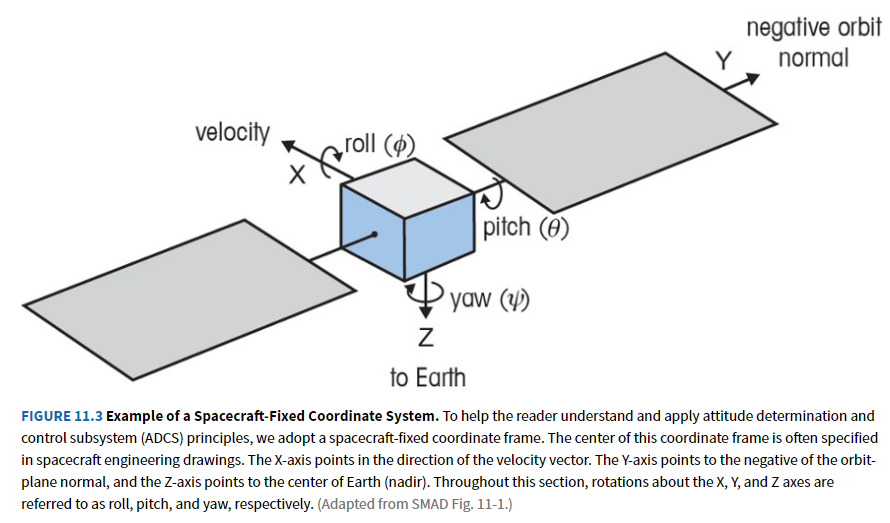
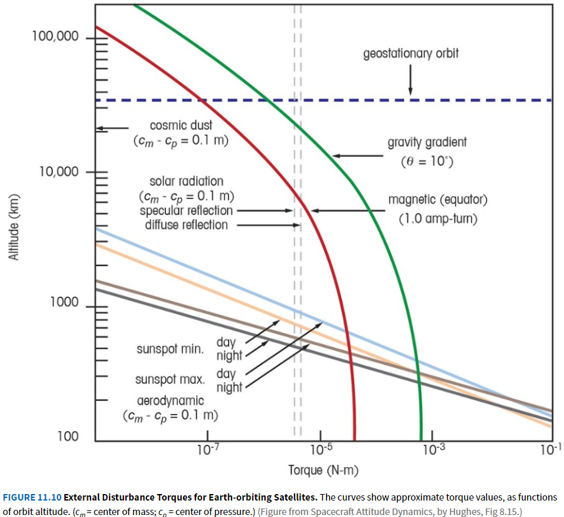

# 17: attitude

## admin

today

- collect HW
- attitude

Tue

- attitude lab
- prelab due 
  - https://www.overleaf.com/read/prdzpknpdtgf

## attitude

ADCS: attitude determination and control system

Stabilizes vehicle and orients it in desired directions during mission, countering internal and external disturbance torques as necessary.

We will discuss actively controlled 3-axis stabilized spacecraft. These spacecraft are intentionally held in a particular orientation depending on mission needs at the time. The selected attitude is chosen to accomplish mission obectives, including:

- point radiators to space
- point solar array to sun
- point sensor to target
- point antenna to ground station
- minimum drag

If these components are steerable, the spacecraft serves as a stable pointing platform. If the components are body-fixed, it is likely impossible to satisfy all mission objectives simultaneously. In this case, the spacecraft and/or its operators must deconflict the schedule to accomplish these objectives at the appropriate times. 

### objectives

- disturbance torques 
- actuator sizing

|           | torque | momentum |
| --------- | ------ | -------- |
| required  |        |          |
| available |        |          |

- attitude sensors

## attitude control

- disturbance torques

- reaction wheels 
  
  - torque
  - momentum

- torque rods (electromagnets)

- thrusters

- (exotics) 
  
  - gravity gradient
  - aerodynamic weathervaning
  - differential reflection

## torque

For a 3-axis stabilized spacecraft, attitude authority (torque) must be greater than disturbance torques. 

### external disturbance torques

| disturbance torque                                           |                                                              |
| ------------------------------------------------------------ | ------------------------------------------------------------ |
| gravity-gradient                                             | $ T_g = \frac{3 \mu}{2R^3} |I_{yaw}-I_{other} | \sin 2\theta $ |
| magnetic  D: spacecraft magnetic dipole, amp-turn-m$^2$ (A m$^2$) N: turns of magnet wire I: magnet current (A) B: Earth’s magnetic field strength strength (T) M: Earth’s magnetic moment ($7.96 \times 10^{15}$ T m$^3$) | $T_m = DB = NIA_{coil} B$  $B_{pole}\approx\frac{2 M}{R^3}$  $B_{equator}\approx\frac{M}{R^3}$ |
| drag                                                         | $T_{drag} = F_{drag} (c_{drag}-c_m)$ $F_{drag} = \frac{1}{2}\rho V^2 C_d A$ |
| solar radiation pressure  q: reflectance (0<q<1, unitless) | $T_{SRP} = F_{SRP} (c_{SRP}-c_m)$ $F_{SRP} = \frac{S_\oplus}{c}A_s(1+q)\cos i$ |
| cosmic dust                                                  | negligible                                                   |

### countering disturbance torques

$$
T_{control} \geq \sum T_{ext} = T_g + T_m + T_{drag} + T_{SRP} + T_{other}
$$

Spacecraft use attitude *actuators* to counter disturbance torques. The first actuator we will consider is reaction wheels. 

### reaction wheel torque

primary means of attitude control

$$
T_{wheel,\ max} = T_{disturbance}(margin+1)
$$

$$
T_{wheel} = T_{disturbance}
$$

$$
T = I \alpha
$$

$$
I_{wheel} \alpha_{wheel} = I_{s/c} \alpha_{s/c}
$$

motor torque is proportional to motor current

$$
T = I k_T
$$

Look at datasheet for attitude lab motor: 1000 RPM 12V brushed DC motor.

[../datasheets/motor.pdf](../datasheets/motor.pdf)

What factors limit motor torque?

- current
  - connectors
  - wires
  - (brushes)
  - motor windings
- power
- energy

Why is this motor unsuitable for space?

- brushes will experience cold welding and create debris
- non-vacuum lubricants will outgas

We’ll look at a commercial reaction wheel in a minute, but here are some of the present difficulties with FalconSAT reaction wheel development.

- balancing wheel is difficult
  - we don’t even know what the requirement is
- at present, having trouble slowing wheel down
  - excess energy is raising supply voltage and controller shuts down
  - capacitor can absorb some of the energy

Look at datasheet for rocketlab reaction wheel. 

[sources/RL-RW-1.0-Data-Sheet.pdf](sources/RL-RW-1.0-Data-Sheet.pdf)

#### slew rate

In addition to $T_{wheel} > T_{disturbance}$, the system may have one additional torque requirement. You may be required to slew through a given distance quickly. 

For example: slew 10 degrees in 30 seconds. 

$$
\ddot{\theta} = \frac{2\dot{\theta}_{max}}{t_f}
$$

$$
\theta_{slew} = t_f \dot{\theta}_{max}/2
$$

$$
\ddot{\theta}_{slew} = \frac{4 \theta_{slew}}{{t_f}^2}
$$

$$
T = I \alpha = I\ddot{\theta}
$$

#### saturation

What happens as the wheel applies torque to counter disturbances?

$$
{h} = \int {T} dt = I {\omega}
$$

The wheel stores increasing momentum by increasing its wheel speed. Eventually the wheel reaches its max speed. This is called saturation.

What happens then?

## momentum

The momentum a reaction wheel can store depends on its maximum speed (and moment of inertia). 

$$
h = I\omega
$$

How much momentum *should* the wheel store?

SMAD’s approach:

- Pick the *single* disturbance torque that produces the most momentum when integrated over one orbit
  - Note: root mean square (quadratic mean) of a sinusoidal function is $\frac{peak}{\sqrt{2}}$
- identify max of $\int T dt$

| disturbance              | periodicity    | momentum req’t  (pick max)       | ω$_{\mathbf{max}}$ req’t                         |
| ------------------------ | -------------- | ------------------------------------- | ------------------------------------------------ |
| gravity-gradient         | $\mathbb{P}/2$ | $h=\frac{T_g }{4\sqrt{2}} \mathbb{P}$ | $\omega_{max}=\frac{T_g\mathbb{P}}{2 I \pi}$     |
| magnetic                 | $\mathbb{P}/2$ | $h=\frac{T_m }{4\sqrt{2}} \mathbb{P}$ | $\omega_{max}=\frac{T_m\mathbb{P}}{2 I \pi}$     |
| solar radiation pressure | may be secular | $h= T_{SRP} \mathbb{P}$               | $\omega_{max}=\frac{T_{SRP}\mathbb{P}}{ I \pi}$  |
| drag                     | may be secular | $h=T_{drag}  \mathbb{P}$              | $\omega_{max}=\frac{T_{drag}\mathbb{P}}{ I \pi}$ |

Ignoring cost or mass concerns, more momentum storage is better. Over a longer time period, it is possible that disturbances will partially cancel each other.  

#### multiple wheels

A 3-axis stabilized spacecraft needs at least 3 reaction wheels to control pointing in 3 dimensions. Spacecraft often use 4 reaction wheels so they can maintain full attitude authority even if one wheel fails. 

$\vec{T}_{wheel} > \vec{T}_{disturbance}$ and $\vec{h} > \int \vec{T} dt $ are properly vector equations. It is unlikely that disturbance torques will all act about the same axis. As a result, you can likely get away with slightly smaller reaction wheels, since they will each be countering a component of the torque. 

## desaturation

So far, we have countered external torques with a reaction wheel, which is an internal attitude actuator. When the wheel reaches its maximum speed, it is said to be saturated and can no longer counter disturbance torques. 

To maintain control of the spacecraft, the spacecraft needs to perform *momentum dumping*—using an external actuator to reject momentum from the system. There are two common external attitude actuators that work in space. 

| actuator                                                 | torque                                                                                                                                                               | cost/limitation                                  |
| -------------------------------------------------------- | -------------------------------------------------------------------------------------------------------------------------------------------------------------------- | ------------------------------------------------ |
| thruster                                                 | $\vec{T} = \vec{F} \times d\vec{r}$                                                                                                                                  | consumes fuel                                    |
| electromagnet  (magnetorquer/ torque rod) | $\vec{T} = \vec{D}\times\vec{B}$  ${T} = {D}{B}\sin\theta$ $\vec{D}=NI\vec{A}$ $B_{pole}\approx\frac{2 M}{R^3}$ $B_{equator}\approx\frac{M}{R^3}$ | adds to power budget additional heat source |

In practice, spacecraft attitude is controlled with reaction wheels. When a wheel becomes saturated, an external actuator is activated to reject momentum from the system. As external actuator operates for a length of time, the wheel speed will gradually slow. The external actuator is turned off when the wheel reaches a predetermined neutral speed (perhaps zero). 

$$
\vec{T} = \frac{d\vec{h}}{dt}
$$

Sometimes a spacecraft is tumbling immediately after deployment or after emerging from a fault condition. It may be tumbling so quickly that the reaction wheels cannot completely eliminate rotation. In this situation, the external actuator must be used to stabilize the spacecraft. 

Changing momentum with thrusters is usually straightforward—fire the thruster(s) pointing in the direction opposite the spacecraft’s rotation. 

If the spacecraft is tumbling, changing momentum with torque rods requires periodic switching of the torque rods to keep the spacecraft’s magnetic dipole correctly aligned with the Earth’s magnetic field (which can also change during the course of an orbit). 

Example: 

https://arc.aiaa.org/doi/pdf/10.2514/1.A33362?casa_token=5N_0uCQfvJAAAAAA:cnLknuLOw86Wf_t3h8zcnCyXGS_X6LoOjVAdOiNEo4anQKcPsuj1NRiG5yuXPhOALIl2e8XQOw

## attitude sensors

| sensor           | approx  accuracy limit | comments                                                              |
| ---------------- | -------------------------------- | --------------------------------------------------------------------- |
| external         |                                  |                                                                       |
| magnetometer     | 1$\degree$                       | 2-axis knowledge (3-axis sensor) required to control torque rods |
| sun              | 0.5$\degree$                     | 2-axis knowledge useful to point solar array                     |
| Earth            | 0.1$\degree$                     | 2-axis knowledge                                                      |
| star             | 0.001$\degree$                   | 3-axis knowledge                                                      |
| differential GPS |                                  |                                                                       |
| internal         |                                  |                                                                       |
| gyroscope        | 0.05$\degree$                    | 3-axis (with 3 gyros) drifts                                     |

## extra information

### spacecraft-caused disturbance torques

Spacecraft factors may cause unwanted disturbance torques. The following torques are internal torques—they don’t reject torque to the outside world. They will reduce pointing accuracy, but they will generally not build up significant momentum before averaging to zero. 

- propellant sloshing 
- rotational motors and pumps
- rotating solar arrays
- steered antennas
- appendage flexing (can be due to thermal expansion at eclipse edge) 

The following items create unintentional external torques.

- thruster misalignment
- mismatched thruster pairs (including stuck thrusters)
- center of mass uncertainty
- residual magnetism and/or current loops

### other stabilization techniques

Passive stabilization techniques exist. Post-2023 you will likely never use them outside of academics. One possible exception is the use of minimum-drag attitudes to conserve fuel. 

Other active stabilization techniques are possible, such as varying reflectance to control torque due to solar radiation pressure. You will never use them. 

## summary

reaction wheel sizing

- torque > disturbance torques
- torque meets any slew rate requirement
- wheel stores sufficient momentum (at least one orbit’s worth)

external actuator sizing

- torque > disturbance torques (generally a trivial requirement)

## homework

- by Tuesday
  - prelab
