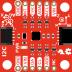

# 19: analysis

today mostly consisted of live coding the analysis of student data

- data: `attitude.csv`
- analysis script: `attitude.m`

## a few notes

Change in heading should be the integral of gyroscope data. As recorded, it is opposite. Why?

Magnetometer axes (used to derive heading) differ from gyroscope axes. The z-axis is backwards. For proper reporting, you should switch it so your data are consistent. 

The wheel speed is measured by a quadrature encoder. Detected direction is ambiguous. Switching the data lines on the quadrature encoder will record the same wheel speed with an opposite sign. For complete consistency, the wheel sensor data lines should be connected such that a positive wheel spin causes the spacecraft heading to move in a negative direction. 

Side note: wheel command direction is also ambiguous. You can change wheel spin direction by either of the following. 

- switch the PWM lines from the Arduino
- switch the motor controller lines (controller to motor)

The changes will negate each other if you switch both. 
