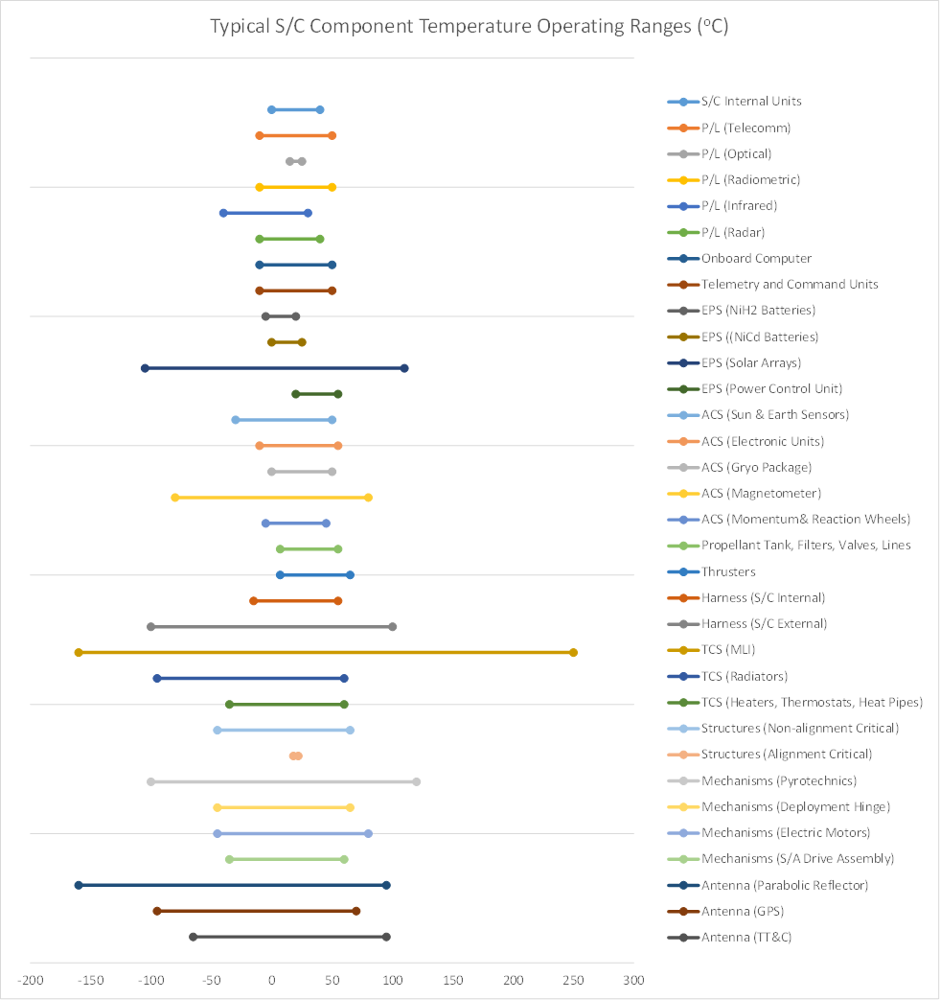

# 20: thermal control

## admin

today

- thermal control

Thu

- lab report due
- project day (syllabus says budgets) 

Mon

- project day

## thermal control

temperature: average mechanical energy per mass

### objectives

- Explain spacecraft thermal control functions

- List and describe the sources of heat on a spacecraft and when they apply

- Describe reflectivity, absorptivity, transmissivity, and emissivity

- List and describe methods of spacecraft thermal control and distinguish between passive and active approaches

- Identify conditions which lead to spacecraft worst case hot and worst case cold equilibrium temperatures

- calculate equilibrium temperatures for spacecraft

Astro 310: maintain spacecraft within temperature limits

Astro 436: maintain spacecraft components within temperature limits

Astro 331: maintain spacecraft bus and solar array within temperature limits

#### limits

- operating limits
- survival limits

Arduino: 

operating limits: -40°C–85°C

recommended limits: -25°C–70°C

#### thermal diagram

we’ve seen this before

absorptivity, emissivity, reflectivity, transmissivity

These characteristics are all wavelength-dependent, but are often summarized to a single value that represents weighted-average values for typical wavelengths

- absorptivity: solar wavelengths
- emissivity: IR wavelengths

#### heat sources

| source                   | average  flux (W/m^2^) | where |
| ------------------------ | --------------------------- | ----- |
| Sun (direct solar)       | 1358                        | 1 AU  |
| albedo (reflected solar) | 407                         | LEO   |
| Earth (IR)               | 237                         | LEO   |
| internal                 |                             |       |

#### heat transfer

- convection
- conduction
- radiation
- 
- ablation

### radiation

$$
Q = \varepsilon \sigma A T^4
$$

- $\sigma = 5.67\times 10^{-8}$ W/K^4^/m^2^

#### black body

-  perfect emitter ($\varepsilon=1$)
- perfect absorber ($\alpha=1$)

$\varepsilon$ and $\alpha$ vary with wavelength, but $\varepsilon_\lambda = \alpha_\lambda$

### thermal equilibrium

$$
Q_{out} + P_{out} = Q_{in} + Q_{internal}
$$

$$
Q_{sun} = 1358\ \mathrm{W/m^2} \alpha A
$$

$$
Q_{albedo} = 407\ \mathrm{W/m^2} \alpha A \frac{R_\oplus}{R_\oplus + h}
$$

$$
Q_{Earth\ IR} = 237\ \mathrm{W/m^2} \varepsilon A \frac{R_\oplus}{R_\oplus + h}
$$

## Astro 331 model

- model deployed solar arrays separately from spacecraft
- find worst-case hot and cold
- uniform power dissipation
- solar arrays are flat plates
- spacecraft is isothermal sphere (same area as real spacecraft)
  - radiates from all surfaces
  - absorbs on one projected side (1/4 of total area)

## example

- h = 700 km

- e = 0
- cube-shaped spacecraft
  - side length = 2.5 m
- internal power: 450–500 W
- deployed solar arrays 
  - A = 7 m^2^
  - P~BOL~ = 1350 W

|             | $\alpha$ | $\varepsilon_{IR}$ |
| ----------- | -------- | ------------------ |
| spacecraft  | 0.6      | 0.8                |
| array front | 0.805    | 0.825              |
| array back  | 0.975    | 0.874              |

find hot and cold equilibrium temperature for spacecraft and solar arrays

# homework

- JWST problem (handout)
