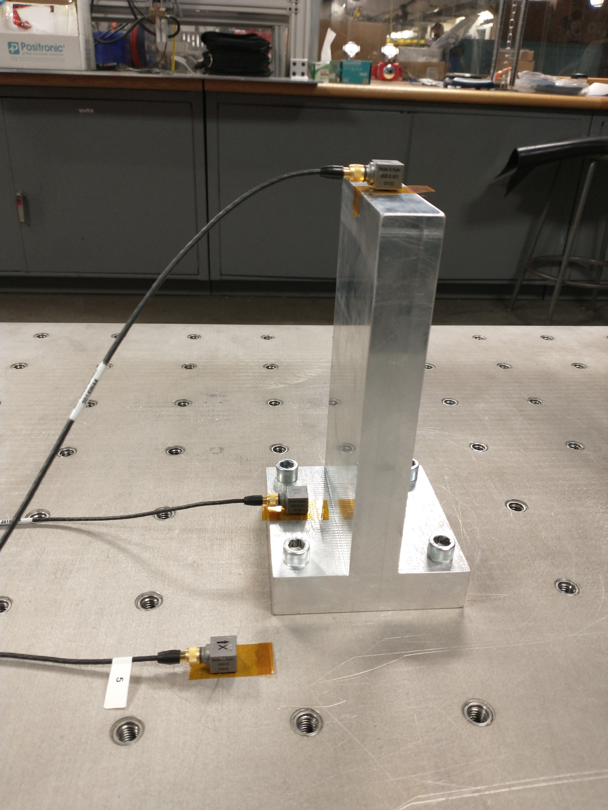

# 28: vibration

## admin

today

- vibration test
- lab tour

## vibration

Today’s lesson consists of a vibration test and lab tour. We will perform a qualification-level test on a cantilever beam to NASA GEVS small-component standards (14G random vibe). 

### Examples

Here is a brief discussion of vibration test results for the cantilever beam shown. 

#### Success

Below is textbook response for a successful vibration test. The random test is close, but not always identical, to the random sine sweeps. The pre- and post-random sine sweeps are identical, and indistinguishable when plotted on top of each other. 

The y-response was similar, although here we see a slight shift in frequency between the pre- and post-random sine sweeps. At SSRC, we have historically considered a test successful if resonant peaks vary in frequency by 5% or less. 

#### Failure

Real parts are more complex and have more vibration modes. This produces a more complex vibration response with multiple resonant peaks. 

Here’s what failure looks like. This is a one-axis test of a USAFA-manufactured reaction wheel (still in development). Resonant peaks have shifted, but beyond that, the entire shape of the response has changed. This indicates that the vibration modes have changed. 

After this test, the wheel could be turned but did not spin freely. Destructive inspection revealed that the permanent magnet on the motor’s rotor fractured into multiple pieces. 

This is the same test of another iteration of the same reaction wheel. The housing of this reaction wheel had an additional bearing intended to support the axle and prevent damage. This time the test was performed on all 3 axes. 

The additional bearing didn’t fix the problem, although the damage was not as severe after this test—the wheel spun freely, however, it made a different noise (more noise) while spinning than it had before a vibration test. 

Non-destructive inspection (x-ray imaging) is ongoing. 

Note: the z-axis response alone would be considered a successful test (except for the fact that it was already broken by then). 

