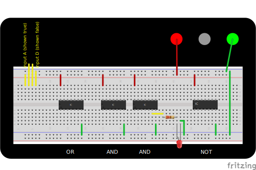

Changes to:

# Familiarization Lab: Digital Logic and Breadboarding

This diagram should have

- clearer “inputs”

- clearer “outputs”

  - don’t link the output to an AND chip, just leave it free

- only needs one of each chip with the new logic diagram

  

