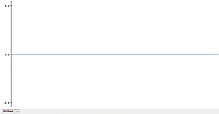
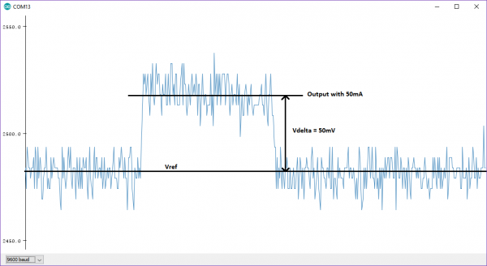

# metrology

> metrology: the science of  measurement, embracing both experimental and theoretical determinations  at any level of uncertainty in any field of science and technology
> -International Bureau of Weights and Measures (BIPM) 

In this introductory lab you will gain familiarity with lab equipment and with taking measurements. 


Previously, you determined the current and voltage limits of a 4-cell solar array. In a future lab you will measure the array's current and voltage output and create an I-V curve to characterize the solar array. In this lab you will begin learning how to measure analog signals with FlatSAT’s Arduino microcontroller. 

To measure the current and voltage provided by FlatSAT’s solar array, you must pick appropriate sensors. 


Today you will try to measure current with 2 sensors (you are building 2 ammeters)

- ACS723
- INA219

You will try to measure voltage with 2 sensors (you are also building 2 voltmeters)

- voltage divider and Arduino ADC
- INA219


## Overview

- voltage measurement

  - voltage divider
  - analog-to-digital converter (ADC)

- current measurement

  - hall effect sensor
  - shunt resistor

- Arduino basics

  

## Hardware 

- FlatSAT
  - Arduino MKR Zero
  - breadboard
  - LCD (16x2 character display)
  - current sensing IC breakout boards
    - INA219 shunt resistor (black)
    - ACS723 Hall effect (red)
  - resistors
  - potentiometer


## Equipment

- benchtop power supply
- ESD-safe grounding straps
- laptop
- Micro USB cable
- multimeter


## Software 

- Arduino IDE
- `06_metrology.ino`
- Arduino libraries (install by running `install_libraries.bat`)
  - LiquidCrystal
  - Adafruit INA219


## Documentation

- Arduino MKR datasheet
- Sparkfun Hall sensor datasheet

- INA 219 datasheet


## Preliminary

- git sync -> pull
- inspect and run `install_libraries.bat`
  - inspect by opening with notepad or notepad++
  - run by double clicking the file name


## Solar arrays limits

For this lab, use these values as your solar array's max current and voltage. 

|              | series | parallel |
| ------------ | ------ | -------- |
| current (mA) | 40     | 160      |
| voltage (V)  | 30     | 7.5      |


## Voltage

To accurately measure FlatSAT's solar array performance, your sensor must be able to measure DC voltage from 0–30 V. 

Investigate this requirement. 


### Arduino limits

Prepare to measure voltage with an Arduino MKR. 

Review the Arduino MKR datasheet. 

- Allowable input voltage: 
  - see the warning at the bottom of page 2
- Max ADC resolution: 

Record these values in your lab notebook. 

Using these values, how many digits do you expect to be able to report for the voltage of FlatSAT's 30 V solar array?

Every sensor is resolution-limited. Sensors provides maximum resolution when the range of the measured signal matches the sensor's detection range. 

To achieve the best available voltage resolution you will need to map the 0–30 V panel voltage to the 0–3.3 V input range of the Arduino MKR. Note: 3.3 V is sometimes referred to as 3V3. 

If you connect anything higher than 3.3 V directly to an input pin on your 3.3 V Arduino, the best possible outcome is that the Arduino will falsely report its maximum of 3.3 V. You may also permanently damage your Arduino. 

To map a 30 V signal to a 3.3 V sensor, you will use a voltage divider. 

### Voltage Divider

>A **voltage divider** is a passive linear circuit that produces an output voltage $V_{out}$ that is a fraction of its input voltage $V_{in}$. **Voltage division** is the result of distributing the input voltage among the components of the divider. A simple example of a voltage divider is two resistors connected in series, with the input voltage applied across the resistor pair and the output voltage emerging from the connection between them.
>-[Wikipedia](https://en.wikipedia.org/wiki/Voltage_divider)


$$
V_{out} = \frac{R_2}{R_1+R_2}V_{in}
$$

Approximately how much do you need to reduce your input voltage? What relative values of $R_1$ and $R_2$ will give you that ratio? Work this out in your lab notebook. 

Now you have to pick actual resistors and make a voltage divider. Use these equations.  

- $V = IR$
- $P=IV$
- your resistors are 1/4 W resistors
- an ideal voltmeter has infinite resistance
  - should you pick large values for $R_1$ and $R_2$, or small values?


Select resistors for R1 and R2. Ensure your resistors won't smoke or catch fire. Record these values in your lab notebook. 

**At this time, explain your choice to your instructor.** 


Begin building FlatSAT. 


For proper connections, use this diagram, component datasheets, and these files:

- `ACS723_pins.h`
- `LCD_pins.h`
- `INA219_pins.h`

**Note:** the brown wire to the LCD display should be replaced by a resistor. Try various values to adjust LCD contrast. 


**Note about power:** Arduino MKR ZERO uses 3.3 V logic and may be damaged if it sees input greater than 3.3 V on any pin (except the 5V in on "Vin" and 5V out on “5V”). However, the LCD display requires 5 V power. Take care to keep the 3.3 V, 5 V, and 25 V power lines separate (all grounds should be connected, including Arduino's ground pin). 

  - Top rail: 5 V (diagram: orange wires)
    - 5V supply comes from VCC pin of Arduino
  - Middle rail: 3.3 V (diagram: yellow wires)
  - Bottom rail: 25 V (solar array---red wires)

While wires are color coded in this diagram, wire color doesn’t matter, except green == ground. 

It is helpful to use short wires to connect to power rails. There will be many wires by the end of the course, so keeping some short will reduce confusion. 


**Note:** Do not connect your Arduino to power or to a computer at this time. 

Place R1 and R2 on the breadboard as shown (2 resistors, bottom middle). The smaller resistor (R2) connects to ground. 

Connect a 30 V power supply to the lugs and rails as shown—30 V to the bottom, ground to any ground rail.

With your multimeter, measure voltages. 

- ground–middle
- ground–top (30 V) 

Ground–middle should be less than 3.3 V. 

**Stop. Do not proceed until Ground–middle is ≤ 3.3 V**

Record these measurements in your lab notebook. 


### Arduino measurement

Now you will measure voltage with Arduino. 

#### Arduino program flow

Review `lab_00a_voltage/lab_00a_voltage.ino`. 


Look at the penultimate line of `lab_00a_voltage/lab_00a_voltage.ino`.

```c++
  delay(100);
```

This line inserts a delay of 100 milliseconds between every run of loop(). This prevents the serial monitor from scrolling uselessly fast. However, it's a terrible way to run a program. Since Arduino is a single-processor microcontroller, nothing else can happen during the delay. 

This is acceptable for a simple program like this one, used to calibrate a sensor. However, FlatSAT constantly needs to accomplish and monitor multiple tasks, so it won't be acceptable in the future. 

#### Verify electrical connections

Energize the power supply. **With a voltmeter, ensure that Arduino pin A1 only sees 3.3 V from ground even when the power supply provides 30 V.** 

#### Measure!

- Connect Arduino to your computer. 

- Select the correct board (tools -> board -> SAMD -> Arduino MKR Zero)

- Select the correct port (COMXX—try one until it works). 

- Click *upload* (right arrow near the top of the window). 

Open the Arduino IDE's serial plotter (tools -> serial plotter). Select "value 1" and unselect "value 2." 

The serial plotter will show a moving graph. Adjust the power supply **downward only** and watch the plotted line move. As the power supply moves from 30 V–0 V, Arduino sees from 3.3 V–0V. What range of values does the serial plotter display? 

This is because of the Arduino’s 12-bit ADC resolution. You must add a scale factor to output the correct voltage. 

Arduino's default ADC resolution is 10-bit. This lab uses the command `analogReadResolution(12);` to instead select a higher 12-bit resolution. 

With an input range of 0–3.3 V and 12-bit/4096 count, Arduino's sensitivity is 0.8 mV/count (3.3V/4096 count). 

To properly display Arduino's measured voltage in mV, you must multiply the ADC reading `volt_counts` by 0.8. 

However, you instead want to display the voltage of your solar array/solar array simulator. You must **multiply the measured voltage** by the ratio of your voltage divider. 

Note: For this calculation, use measured resistance values for R1 and R2 rather than their specification values. 

$voltage = volt\_ counts * \left(\frac{0.8\ mV}{count} * \frac{R_1}{R_1+R_2}\right)$ 

Calculate this factor and change the following code line to include the proper scale factor (instead of `sensitivity`, which was set to 1 earlier in the code). 

```c++
volts = volt_counts * 1.0;
```

Upload this modified code and ensure that the serial plotter matches the output of your power supply. If not, adjust as necessary. 

Congratulations! You can measure voltage! 

### Intermediate cleanup

- de-energize the benchtop power supply (on/off button not illuminated)
- disconnect Arduino

## Current

There are two general ways to measure current. You will use both of them. 

- measuring the induced magnetic field around a current-carrying conductor
- measuring a voltage drop across a known resistance

Connect the current sensors, blue potentiometer, and associated wires. These are the three components on the bottom right. Some of the wires are shown on top of sensors for clarity, but they will connect to the breadboard under the sensors—Place these wires before you connect the sensors. 


Current will flow from the 12/24 V rail, through the INA219 sensor (shunt resistor), through the ACS723 sensor (Hall effect), through a variable resistor (blue potentiometer), to ground. This setup ensures both sensors are measuring the same current. 

The solar array current you are trying to measure is very small (as low as 40 mA in parallel), so you will need a very sensitive current sensor. 


### INA219 shunt resistor sensor (Ohm's law)

Now try measuring current with a different sensor: INA219 (on an Adafruit breakout board). This sensor uses Ohm's law (V=IR) to calculate current from the voltage drop across a known precision resistor. 

Review the INA219 datasheet. Record the Voltage and Current range in your lab notebook. Is this a suitable current sensor? 

INA219 measures both current and voltage—there is no need for a separate voltage divider circuit. 

The INA 219 current sensor communicates with Arduino using I2C. Communication is handled with the Adafruit_INA219 library. 


#### Arduino program flow

Open `06_metrology.ino`. 

Scan through the file and look at these lines

```c++
  int interval = 500; // writes measurements every XX ms
  int present = millis(); 
  int due = present += interval; 

void loop() {

  present = millis(); 
  if (present >= due){
    ...
    due += interval; 
  } // end if (present >= due)
  
  } // end function loop()
```

Instead of using delay, this sketch constantly runs as fast as it can. If it's time to write data (every 500 milliseconds), it will write data to the serial port and the LCD. This method is better than `delay()` because it allows Arduino to continue running and performing other functions. 

In the Arduino ecosystem, this method of program control is often called BWD (blink without delay). However, this example is better than the default BWD example because of the way it measures the delay. 

This code also uses a running average of the last 10 samples to report current and voltage. This makes sensor latency (slightly) worse, but it helpfully reduces flickering and noise. If interested, look for `num_samples` and `averaging_index` in the code. 

#### Measure! 

Your code should already be running with an energized power supply. In the serial plotter, select values 2, 3, and 5. 

Now you can see voltage and current displayed on the serial plotter. Adjust the power supply's output current and watch the values change. 

How much noise do you see? Try at 160 mA, 40 mA, and 10 mA. 

Is the INA219 sensor suitable for monitoring FlatSAT's solar array?

Record observations in your lab notebook. 


### ACS723 Hall effect sensor

You will use the low current version of Sparkfun's ACS723 breakout board. Read the highlighted datasheet now. Is this a suitable sensor?

**Note: You will use Vcc = 3.3 V to avoid damaging the Arduino MKR Zero.**

#### Calibration and Example Code

The following instructions are modified from the example provided at https://learn.sparkfun.com/tutorials/current-sensor-breakout-acs723-hookup-guide. 

#### Setting Vref 

Connect Arduino to the computer. 

The ACS 723 is an analog device that measures current and outputs a proportional voltage on its Vout pin. 

`06_metrology.ino` reads that voltage from pin A4 and prints it (as a 0-4096 count value) to the serial terminal (as the 4th value). 

To set up Vref, the sensor should have no current flowing through it. Leave the benchtop power supply off.  You can also (optionally) read the output voltage using a [multimeter](https://www.sparkfun.com/products/12966). 

In the serial plotter unselect all values except "value 4."  Value 4 shows the voltage reading (as a 0-4096 count value) from the Arduino in real time. 

With a #1 Phillips screwdriver, turn the Vref potentiometer clockwise to increase Vref and counter-clockwise to decrease. Make small adjustments, as the adjustment is very sensitive!

**Note:** Using metal/magnetized screwdrivers may cause the sensor to give false readings. This is because the Hall effect sensor inside is picking up the magnetic fields from the screwdriver. If you experience this, simply make a small adjustment and then move the screwdriver away to see the result. 

In the Serial Plotter, you should see something like this:



Since you are measuring a positive DC current, Vref should (ideally) be zero. However, the Vref potentiometer can go past zero, and when it does the sensor produces no output. To avoid that, adjust Vref to almost zero (turn to zero, and then turn back until the line just moves. 

#### Setting Gain/Sensitivity

Turn the potentiometer to its lowest position. 

To set the gain, you need to pass a known current through the sensor and tune the gain pot to achieve the sensitivity your application needs. Since you are measuring a small current, you will first try with gain/sensitivity set to maximum. 

The risks of maximum gain are noise (spiky data) and clipping. Clipping occurs when the measured current exceeds the limits of your system. For example, in this circuit, if 100 mA registers as 3.3 V, the current sensor will be unable to distinguish between 100 mA and 150 mA. 

Turn on your benchtop power supply (3.3 V, 150 mA). The serial plotter should show a new output voltage. 

With a known constant current flowing through the sensor, the gain can be adjusted. Adjust the gain to its maximum. The serial plotter should show a higher output voltage. 

If you have problems, you may have to reverse current flow (swap the leads at the power supply) and/or adjust Vref to its maximum. 

Disconnect and reconnect the IP+ wire to find output voltage at (near) the expected limits of your solar array's power input. Can you usefully detect this current? 

Using Vdelta, calculate sensitivity (mA/mV) and adjust the following line of code. 

```c++
float current = (curr_counts*0.8 - Vref) * sensitivity;
```




Attempt to measure 40 mA and 10 mA. Record your observations. Is this a suitable sensor? 


## Think about calibration

Are the values reported by these sensors accurate? If you needed a more accurate measurement, how would you accomplish it? 

How does SSRC accomplish accurate measurements when working on FalconSAT? 

- We send our measurement equipment to the local AF PMEL (precision measurement equipment laboratory) for calibration.

How does PMEL ensure the accuracy of their calibration standards? 


## Cleanup
- disconnect Arduino
- de-energize and turn off power supply (switch on the back)
- Remove the ACS723 sensor (red) and associated wires. Connect the INA219’s V- terminal directly to the potentiometer. 
- remove the voltage divider (resistors)
